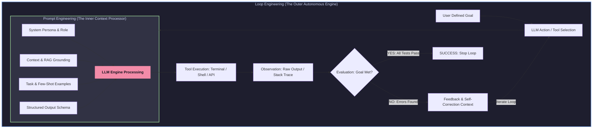

# The Complete Guide to Prompt Engineering & Loop Engineering

> **Author / Persona**: Senior AI/LLM Engineer & Prompt Engineering Mentor  
> **Audience**: Beginners seeking job-ready clarity and technical interview confidence  
> **Topic**: Writing Optimized Prompts, Prompt Engineering, and Loop Engineering  

---

## Table of Contents
1. [Writing Optimized Prompts](#1-writing-optimized-prompts)
   - [What Makes a Prompt Effective?](#what-makes-a-prompt-effective)
   - [Key Components of a Good Prompt](#key-components-of-a-good-prompt)
   - [Step-by-Step Prompt Evolution](#step-by-step-prompt-evolution)
   - [Universal Reusable Prompt Template](#universal-reusable-prompt-template)
   - [Common Prompting Mistakes](#common-prompting-mistakes)
2. [Prompt Engineering](#2-prompt-engineering)
   - [Definition & Core Concepts](#definition--core-concepts)
   - [Why Prompt Engineering is Needed](#why-prompt-engineering-is-needed)
   - [How Prompt Engineering Works Under the Hood](#how-prompt-engineering-works-under-the-hood)
   - [Essential Techniques (with Examples)](#essential-techniques-with-examples)
   - [Real-World Applications](#real-world-applications)
3. [Loop Engineering](#3-loop-engineering)
   - [Definition & Agentic Framework](#definition--agentic-framework)
   - [Why Loop Engineering is Necessary](#why-loop-engineering-is-necessary)
   - [The 8-Stage Agent Loop](#the-8-stage-agent-loop)
   - [Core Pillars: Feedback, Verification, Tools, Retries, & Stopping Conditions](#core-pillars-feedback-verification-tools-retries--stopping-conditions)
   - [Practical Walkthrough: Coding Agent Debugging Loop](#practical-walkthrough-coding-agent-debugging-loop)
   - [Real-World Applications](#real-world-applications-1)
4. [Comparison Matrix](#4-comparison-matrix)
5. [Final Revision Section](#5-final-revision-section)
   - [Interview Definitions](#interview-definitions-2-3-lines-each)
   - [5 Key Takeaways to Remember](#5-key-takeaways-to-remember)
   - [Integrated System Architecture Diagram](#integrated-system-architecture-diagram)
   - [Beginner MCQs & Answer Key](#beginner-mcqs--answer-key)

---

## 1. Writing Optimized Prompts

### What Makes a Prompt Effective?
A prompt is effective when it eliminates ambiguity and guides the Large Language Model (LLM) toward producing the exact desired result on its first attempt. 

Think of an LLM as a **brilliant intern with amnesia**. If you give them vague instructions ("write a report"), you will get a generic, unfocused result. If you give them clear boundaries, target audiences, structural rules, and examples, they perform at an executive level.

An effective prompt balances **Clarity, Specificity, Contextual Scope, and Format Constraints**.

---

### Key Components of a Good Prompt

To write a professional-grade prompt, assemble these seven structural components:

```
[ROLE] + [CONTEXT] + [TASK] + [REQUIREMENTS] + [CONSTRAINTS] + [EXAMPLES] + [OUTPUT FORMAT]
```

1. **Role (Who should the AI act as?)**: Assigns a persona, mindset, domain knowledge, and tone.
   - *Example*: "Act as a Senior Python Backend Architect."
2. **Context (What is the background situation?)**: Gives the model necessary domain rules, project state, or target audience details.
   - *Example*: "We are migrating a legacy REST API to FastAPI to improve throughput for high-concurrency microservices."
3. **Task (What is the primary action?)**: The specific objective to be accomplished.
   - *Example*: "Write an asynchronous database connection pool handler using `asyncpg`."
4. **Requirements (What must be included?)**: Specific guidelines, functional criteria, or quality standards.
   - *Example*: "Include connection health checks, error logging, and explicit type hints."
5. **Constraints (What must be avoided or restricted?)**: Guardrails, budget limits, length limits, or negative rules.
   - *Example*: "Do not use synchronous libraries like `psycopg2`. Do not use external ORMs like SQLAlchemy."
6. **Examples (Few-Shot Demonstrations)**: Sample input/output pairs that illustrate expected behavior.
   - *Example*: "Input: `DATABASE_URL` → Output format shown below..."
7. **Output Format (How should the answer be presented?)**: Specifies code blocks, markdown headings, bullet points, or strict schemas (JSON, YAML).
   - *Example*: "Return ONLY executable Python code inside a single ```python markdown block, with zero explanatory conversational text."

---

### Step-by-Step Prompt Evolution

Let's take a **poor prompt** and transform it step-by-step into an **optimized prompt**.

#### ❌ Poor Prompt (Vague & Ambiguous)
> "Write a script to validate email addresses."

*Why it fails*: 
- Which language? 
- Should it use regex or an API? 
- How should invalid emails be reported? 
- Should it print to console or return a list?

---

#### 🟡 Step 1: Add Role & Task Specificity
> "Act as a Senior Python Developer. Write a Python script using regular expressions to validate email addresses."

---

#### 🟡 Step 2: Add Context & Target Audience
> "Act as a Senior Python Developer. We are building a user registration pipeline for an e-commerce platform. Write a Python script using regular expressions to validate incoming email addresses."

---

#### 🟡 Step 3: Add Requirements & Constraints
> "Act as a Senior Python Developer. We are building a user registration pipeline for an e-commerce platform. Write a Python script using regular expressions to validate incoming email addresses.  
> Requirements:  
> - Check for standard email syntax (user@domain.com).  
> - Support modern TLDs (.io, .dev, .tech).  
> - Return a dictionary containing `{"email": str, "is_valid": bool, "reason": str}`.  
> Constraints:  
> - Do not use third-party libraries (use Python's built-in `re` module only).  
> - Do not include conversational fluff."

---

#### Step 4: Add Example & Output Format (Final Optimized Prompt)

```markdown
Act as a Senior Python Developer. 

### Context
We are building an automated user registration pipeline for a web application. Incoming raw registration payloads need instant syntax validation before hitting the main database.

### Task
Write a clean, production-ready Python function named `validate_email_payload(email: str) -> dict`.

### Requirements
1. Validate email syntax using Python's built-in `re` module.
2. Ensure it handles standard formats, subdomains, and modern TLDs (e.g., user@mail.domain.io).
3. Return a Python `dict` with key fields:
   - `email` (str): The input email evaluated.
   - `is_valid` (bool): `True` if valid, `False` otherwise.
   - `reason` (str): "Success" or explanation of syntax failure (e.g., "Missing @ symbol", "Invalid domain format").

### Constraints
- Use ONLY Python standard library modules (`re`, `typing`).
- Include full docstrings and type annotations.
- Avoid third-party dependencies.

### Example Expected Output
Input: "test.user@tech.co"
Output: {"email": "test.user@tech.co", "is_valid": True, "reason": "Success"}

### Output Format
Provide the complete Python code block followed by 3 unit test cases using `unittest`.
```

---

### Universal Reusable Prompt Template

Copy and adapt this template for any domain task:

```markdown
### Persona / Role
Act as an expert [Insert Role, e.g., Senior Security Engineer / Technical Copywriter / Data Analyst].

### Background & Context
[Insert 2-3 sentences explaining the situation, target audience, and business objective].

### Primary Task
[Insert explicit action statement beginning with a strong verb, e.g., Analyze, Refactor, Generate, Summarize].

### Functional Requirements
- Requirement 1: [Specific inclusion]
- Requirement 2: [Specific standard or method]
- Requirement 3: [Edge cases to handle]

### Operational Constraints
- Constraint 1: [What NOT to do]
- Constraint 2: [Length, budget, or tool limits]
- Constraint 3: [Library / Technology restrictions]

### Few-Shot Example (Optional but Recommended)
Input: [Sample Input Data]
Expected Output: [Sample Desired Output Format]

### Desired Output Format
[Specify format: Markdown Table / Raw JSON / Executable Code / Bulleted Summary].
```

---

### Common Prompting Mistakes

| Mistake | Why it Hurts Output | Corrective Action |
| :--- | :--- | :--- |
| **Vagueness / Ambiguity** | Forces the LLM to guess intentions. | Specify target audience, language, tools, and goals explicitly. |
| **Negative Instructions Only** | Telling the LLM "Don't do X" without stating what TO do. | Rephrase rules positively ("Use option A instead of option B"). |
| **Over-stuffing Instructions** | Exceeding key context focus with conflicting rules. | Keep instructions modular, organized with headings/bullets. |
| **Omitting Output Schema** | Getting freeform text when raw JSON or code is needed. | Provide explicit JSON key schemas or code wrapper requirements. |
| **Assuming Implicit Memory** | Believing the LLM remembers unstated project setup. | Always provide relevant code snippets or schemas in the prompt context. |

---

### Prompt Engineering Tips
Here are some practical tips to keep in mind when working with LLMs:
1. **Ask negative Questions**: Frame questions to explore boundaries or what the model should avoid doing.
2. **Old LLMs are trained with Old Information**: Be aware that models have knowledge cutoffs and might lack recent context.
3. **Check LLM result with other LLM**: Cross-verify outputs across different models to ensure accuracy and reduce hallucinations.
4. **Plan before coding**: Create flowcharts, sequence diagrams, and test cases first, then start the development work.
   - *Example*: Do not begin coding until the flowchart and sequence diagram match your expectations to complete the task.

---

## 2. Prompt Engineering

### Definition & Core Concepts

**Prompt Engineering** is the strategic discipline of designing, optimizing, and programmatically managing input prompts, context windows, and model configurations to elicit reliable, accurate, and safe outputs from Large Language Models without retraining model weights.

> **Analogy**: If *Writing Optimized Prompts* is like crafting a single clear email, *Prompt Engineering* is like designing an automated email routing system with templates, metadata rules, and fallback mechanisms.

---

### Why Prompt Engineering is Needed

1. **LLMs are Probabilistic Engines**: Models predict the next token based on statistical probabilities. Small changes in phrasing drastically shift the attention weights.
2. **Hallucination Prevention**: Without grounding context, LLMs generate plausible-sounding falsehoods.
3. **Systemic Automation**: Software applications (like customer chatbots or code review bots) cannot rely on manual, ad-hoc typing; they require deterministic, repeatable prompt structures.
4. **Cost & Latency Reduction**: Efficient prompt context minimizes token usage, saving API costs and reducing response latency.

---

### How Prompt Engineering Works Under the Hood

When an LLM processes your prompt:
1. **Tokenization**: Text is converted into numeric tokens.
2. **Context Window Attention**: The model applies self-attention across all tokens in the context window.
3. **Role Conditioning**: System prompts establish high-priority conditioning vectors that govern downstream token probabilities.
4. **Sampling & Decoding**: Parameters like `Temperature` (randomness control) and `Top-P` (nucleus sampling) determine final token selection.

```
Raw User Input ──► System Prompt Wrappers + Context Retrieval (RAG) ──► Tokenizer ──► LLM Attention Engine ──► Structured Output Parsing
```

---

### Essential Techniques (with Examples)

#### 1. Zero-Shot Prompting
Asking the model to perform a task without giving any prior examples. Best for simple, standard tasks.

```markdown
Translate the following English phrase to French: "Where is the nearest train station?"
```

#### 2. Few-Shot Prompting
Providing 1 to 5 input-output pairs to teach the model a custom format or pattern before asking it to solve the new input.

```markdown
Classify the sentiment of customer reviews into Positive, Neutral, or Negative.

Review: "The product arrived two days late, but customer support fixed it."
Sentiment: Neutral

Review: "The build quality is terrible and it stopped working after one hour."
Sentiment: Negative

Review: "Absolute game changer! Doubled our team's productivity."
Sentiment: Positive

Review: "The package was intact, but the blue color looks slightly darker than the website photo."
Sentiment:
```

#### 3. Role Prompting (System Prompts)
Assigning a specialized persona to anchor the model's domain perspective, vocabulary, and strictness.

```markdown
System: You are an expert Cyber Security Auditor specializing in OWASP Top 10 vulnerabilities. Review all code strictly for SQL Injection, XSS, and broken authentication.
```

#### 4. Structured Output (JSON / Schema Enforcement)
Forcing the LLM to return valid JSON, XML, or SQL so downstream software can parse it deterministically without breaking.

```markdown
Extract key entity information from the text below. 

Return ONLY valid JSON matching this schema:
{
  "person_name": string,
  "organization": string,
  "action_items": array of strings
}

Text: "Alex Smith from Quantum Tech requested a follow-up call next Tuesday to finalize the cloud migration contract."
```

#### 5. Context Provision & Grounding (RAG Foundation)
Injecting trusted external source documents into the context window so the LLM answers strictly based on facts provided, avoiding hallucination.

```markdown
Answer the question based ONLY on the provided context below. If the answer cannot be determined from the context, state "Information not found."

Context:
[Acme Corp Policy Section 4.2: Employees working remotely are eligible for an annual home office hardware stipend of up to $500. Receipts must be submitted by November 30th.]

Question: How much hardware stipend can an employee claim, and what is the deadline?
```

---

### Real-World Applications

- **Enterprise Knowledge Bots (RAG)**: Chatting with internal company PDFs and Notion documents.
- **Automated Data Extraction**: Converting unstructured receipts or legal contracts into structured SQL databases.
- **Code Assistants (Copilot / Antigravity)**: Translating natural language instructions into unit tests, refactored functions, or shell commands.
- **Classification & Moderation Systems**: Automatically flagging inappropriate comments or categorizing support tickets.

---

## 3. Loop Engineering

### Definition & Agentic Framework

**Loop Engineering** is the architectural practice of building autonomous, closed-loop state machines around Large Language Models. Instead of relying on a single prompt-response cycle, a loop-engineered agent iteratively **executes actions**, **observes environment feedback**, **evaluates outcomes against goals**, and **self-corrects** until completion.

```
       ┌─────────────────────────────────────────────────────────────┐
       │                                                             │
       ▼                                                             │
┌─────────────┐     ┌──────────────┐     ┌──────────────┐     ┌──────┴──────┐
│  1. GOAL    ├────►│  2. ACTION   ├────►│3. OBSERVATION├────►│ 4. EVAL/    │
│ (Define End)│     │(Tool/Code)   │     │(Stdout/Error)│     │   FEEDBACK  │
└─────────────┘     └──────────────┘     └──────────────┘     └──────┬──────┘
                                                                     │
                                    ┌────────────────────────────────┤
                                    │ Goal Satisfied?                │
                                    ├───► YES ──► [ STOP ]           │
                                    └───► NO  ──► [ 5. IMPROVE/REPEAT]
```

> **Analogy**: *Prompt Engineering* is writing a map. *Loop Engineering* is putting an autonomous driver behind the wheel, giving them real-time GPS sensors, a steering wheel, and a brake pedal so they can recalculate routes when they hit a detour.

---

### Why Loop Engineering is Necessary

Single-shot LLMs suffer from fundamental limitations:
1. **No External Memory or Real-World Verification**: An LLM cannot know if generated code compiles unless it actually runs it in a terminal shell.
2. **Complex Multi-Step Tasks**: Tasks like "build a full-stack login system" cannot be solved in one step. They require multi-turn planning, file creation, linting, testing, and debugging.
3. **Self-Correction Capacity**: Humans solve complex problems by trial and error. Loop engineering gives LLMs the exact same runtime trial-and-error environment.

---

### The 8-Stage Agent Loop

Every agentic loop follows eight distinct execution steps:

1. **Goal**: The ultimate target defined by the user (e.g., "Fix broken unit tests in `auth.py`").
2. **Action**: The LLM chooses a tool to invoke (e.g., `run_command("pytest tests/")` or `write_to_file(...)`).
3. **Observation**: The system captures raw real-world output from the action (e.g., terminal output, HTTP status code, database error stack trace).
4. **Evaluation**: The system or model inspects the observation against success criteria.
5. **Feedback**: Synthesizing the error log or metric into a clear diagnostic signal (e.g., `AssertionError on Line 42: expected 200 OK, got 401 Unauthorized`).
6. **Improvement**: Formulating a modified strategy or code fix based on the feedback.
7. **Repeat**: Re-entering the loop with updated context and attempting the next corrective action.
8. **Stop**: Gracefully terminating when success conditions are met or safety limits are triggered.

---

### Core Pillars: Feedback, Verification, Tools, Retries, & Stopping Conditions

| Pillar | Role in Loop Engineering | Example in Practice |
| :--- | :--- | :--- |
| **Feedback** | Closed-loop error signals delivered to the LLM context. | Raw stack trace from a failing compiler or linter. |
| **Verification** | Deterministic engines (non-LLM) that confirm success objectively. | `pytest` test suite passing with exit code 0. |
| **Tools** | Interfaces that allow the LLM to manipulate the environment. | File search (`grep`), code edit (`replace_file_content`), command runner (`powershell`). |
| **Retries** | Systematic fallback mechanisms to prevent getting stuck in infinite loops. | Max 5 iteration limits with strategy variation. |
| **Stopping Conditions** | Rules that safely break the loop. | Goal achievement, max token budget spent, or user cancellation. |

---

### Practical Walkthrough: Coding Agent Debugging Loop

Let's watch a Loop Engineering agent fix a broken Python function in real time:

#### Iteration 1:
- **Goal**: Ensure function `calculate_discount(price, tier)` returns correct discount percentage.
- **Action**: Agent edits `discount.py` and runs `pytest test_discount.py`.
- **Observation**: Terminal returns error: `TypeError: can't multiply sequence by non-int of type 'float'`.
- **Evaluation**: Test failed.
- **Feedback**: The parameter `price` is passed as a string `"100"` from API payload instead of `float`.

#### Iteration 2:
- **Improvement**: Agent modifies `discount.py` to add explicit type conversion: `price = float(price)`.
- **Action**: Agent re-runs `pytest test_discount.py`.
- **Observation**: Terminal returns `2 passed in 0.04s`. Exit code `0`.
- **Evaluation**: All tests pass.
- **Stop**: Goal achieved! Agent reports success to user.

---

### Real-World Applications

- **Autonomous Coding Agents**: Tools like Antigravity, Devin, and Cursor Agent Mode.
- **Automated Web Scraping**: Bots that navigate dynamic sites, solve CAPTCHAs, handle pagination failures, and retry.
- **DevOps & Self-Healing Pipelines**: CI/CD bots that catch deployment errors, read Kubernetes logs, revert bad commits, and notify engineers.
- **Customer Resolution Agents**: AI agents that query databases, process refunds via APIs, verify transaction status, and update tickets automatically.

---

## 4. Comparison Matrix

| Dimension | 1. Writing Optimized Prompts | 2. Prompt Engineering | 3. Loop Engineering |
| :--- | :--- | :--- | :--- |
| **Primary Purpose** | Clear human-to-AI communication for single tasks. | Designing reproducible prompt pipelines & context systems. | Enabling autonomous goal execution and self-correction. |
| **Core Focus** | Crafting precise text, role, constraints, and instructions. | Structuring inputs, techniques (few-shot, RAG, JSON), & parameters. | Managing state loops, tool integration, feedback, & execution. |
| **Scope** | Single prompt / single turn interactions. | Entire application prompt architectures & context retrieval. | Multi-step agentic workflows and dynamic runtime execution. |
| **Feedback Mechanism** | Manual human review of the generated response. | Programmatic prompt validation or output schema parsers. | Closed-loop runtime environment (terminal logs, test suites, APIs). |
| **Automation Level** | Low (Manual typing). | Medium (Automated template injection & parsing). | High (Fully autonomous iterative loop execution). |
| **Typical Example** | Writing a prompt to generate a blog post outline. | Building a JSON extraction API pipeline using few-shot prompts. | A coding agent running unit tests, fixing errors, and re-testing until green. |
| **When to Use Each** | One-off questions, brainstorming, ad-hoc drafting. | Production apps requiring structured, consistent output. | Complex multi-step tasks requiring real-world tools & verification. |

---

## 5. Final Revision Section

### Interview Definitions (2–3 Lines Each)

#### 1. Writing Optimized Prompts
> *"Writing Optimized Prompts is the practice of crafting clear, highly structured natural language instructions—incorporating role, context, task, constraints, and output format—to get accurate single-shot outputs from an LLM."*

#### 2. Prompt Engineering
> *"Prompt Engineering is the technical discipline of designing, programmatically structuring, and managing context inputs, retrieval strategies (RAG), and output schemas to reliably guide LLM behavior across software applications."*

#### 3. Loop Engineering
> *"Loop Engineering is the architecture of closed-loop agent systems where an LLM repeatedly executes tool actions, observes real-world environmental feedback, evaluates progress, and self-corrects until a specific complex goal is achieved."*

---

### 5 Key Takeaways to Remember

1. **Clarity Over Brevity**: Never make the model guess. Define Role, Context, Task, Constraints, and Output Format explicitly.
2. **Structure Guarantees Reliability**: Use structured formats like JSON schemas or XML wrappers for application pipelines.
3. **Grounding Prevents Hallucinations**: Inject verifiable context (RAG) into prompts to anchor LLM responses in real facts.
4. **Single-Shot Has Limits**: Complex tasks cannot be solved in one step; they require environment execution and feedback.
5. **Loops Enable Autonomy**: Loop Engineering turns LLMs from static text generators into autonomous agents by combining **Goal → Action → Observation → Evaluation → Feedback → Stop**.

---

### Integrated System Architecture Diagram

This diagram shows how Prompt Engineering crafts the internal engine, while Loop Engineering wraps it in an autonomous runtime loop:



---

### Beginner MCQs & Answer Key

#### Q1. Which element of an optimized prompt prevents the LLM from using unauthorized third-party libraries?
- A) Role
- B) Few-Shot Example
- C) Constraints
- D) Context

#### Q2. What is the primary difference between Zero-Shot and Few-Shot prompting?
- A) Zero-Shot uses no tokens, while Few-Shot uses maximum tokens.
- B) Zero-Shot provides no input-output examples, while Few-Shot provides 1 or more examples.
- C) Zero-Shot only works in Python, while Few-Shot works in JavaScript.
- D) Zero-Shot requires Loop Engineering.

#### Q3. Why is Loop Engineering necessary for building autonomous AI coding agents?
- A) Because single prompts cannot run terminal commands or evaluate unit test execution logs.
- B) Because LLMs cannot understand English without a loop.
- C) Because Loop Engineering trains new neural networks from scratch.
- D) Because prompts expire after 60 seconds without a loop.

#### Q4. In the 8-stage agent loop, what is an "Observation"?
- A) The initial prompt written by the human user.
- B) The raw output or log returned after an action/tool is executed.
- C) The cost of the API call in dollars.
- D) The system prompt assigning the AI's persona.

#### Q5. What is the primary role of "Verification" in a loop-engineered agent?
- A) To ask the user to manual check every line of text.
- B) To provide deterministic, objective proof (like unit tests or schema validation) that an action succeeded.
- C) To make the prompt longer.
- D) To translate code into different languages.

---

### Answer Key & Explanations

1. **Correct Answer: C (Constraints)**  
   *Explanation*: Constraints explicitly define guardrails and negative rules, such as restricting specific libraries or limits.
2. **Correct Answer: B**  
   *Explanation*: Few-shot prompting relies on demonstrating sample input-output pairs to guide the model's pattern recognition.
3. **Correct Answer: A**  
   *Explanation*: LLMs generate text; they cannot execute code or verify compile results without an outer loop system with tool execution.
4. **Correct Answer: B**  
   *Explanation*: An observation is the environment's response (stdout, stderr, API response) captured after taking an action.
5. **Correct Answer: B**  
   *Explanation*: Verification uses deterministic checkers (e.g. `pytest`, JSON schema validators) to prove success objectively before stopping the loop.
